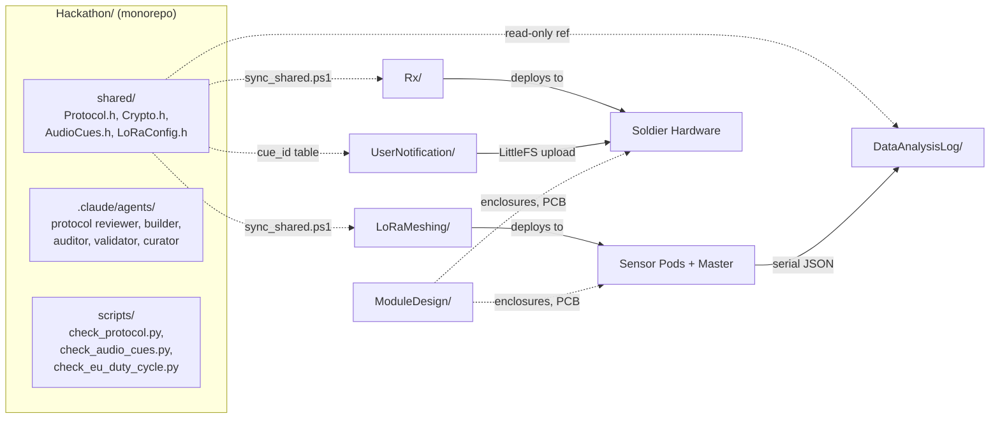
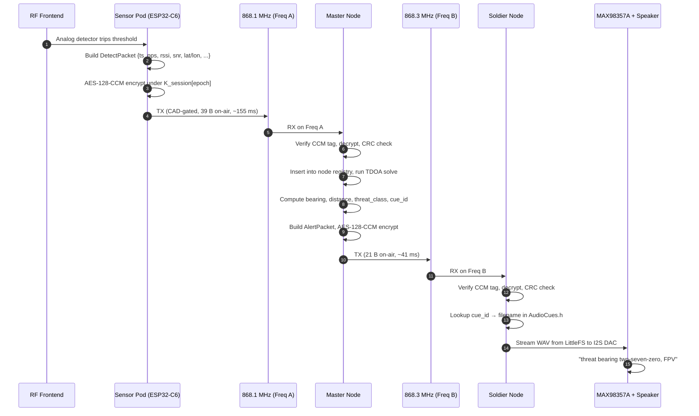
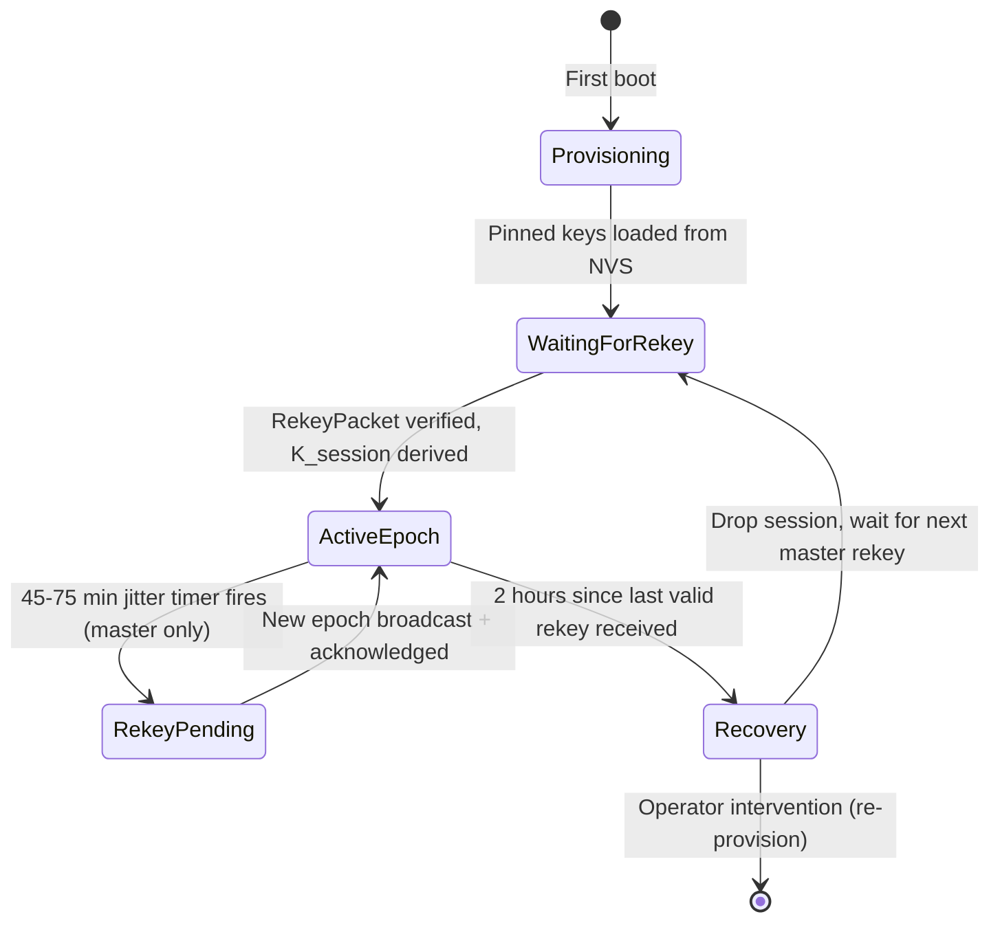
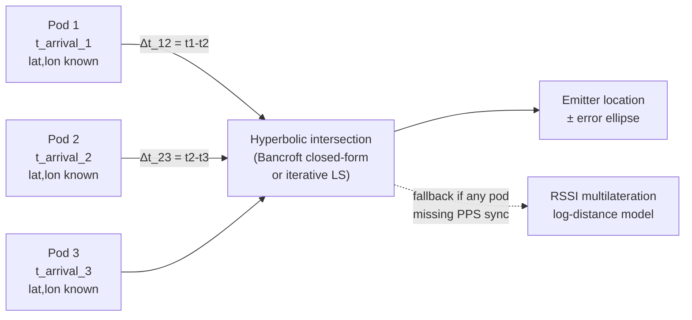

# Architecture

## Subsystems

## Packet life-cycle (one detection)

## Key rotation life-cycle

## TDOA math (overview)

Each pod must have:
- Surveyed lat/lon (or live GNSS lock, ideally both)
- GPS-PPS pin wired to GPIO interrupt; `micros()` captured on PPS rising edge gives sub-microsecond cross-node sync.
- Same view of the emitter — detection threshold must trip on all ≥3 pods within the ~10 ms sync window for TDOA to be solvable.

## Sub-band frequency plan (per pod variant)

| Pod variant | Frontend | Detection method | Output to packet |
|---|---|---|---|
| **A — 5.8 GHz FPV video** | 5.8 GHz LNA → AD8318 log detector → ADC | Power threshold + dwell time | `band_id=BAND_5800_MHZ`, `rssi_dbm` from log-detector mapping |
| **B — 2.4 GHz FPV control** | 2.4 GHz LNA → AD8318 → ADC | Power threshold + FHSS pattern detect | `band_id=BAND_2400_MHZ`, `flags.FREQ_HOPPER` set on dwell pattern |
| **C — GNSS L1 jam** | 1.575 GHz SAW → LNA → log detector | Noise-floor rise vs baseline | `band_id=BAND_GNSS_L1`, `flags.GNSS_JAM_SUSPECTED` |
| **D — 900 MHz / ELRS** | 900 MHz LNA → log detector | Power + LoRa-chirp shape detect | `band_id=BAND_433_915_MHZ` |
| **E (future) — 30–88 MHz tactical** | HF/VHF SDR (RTL-SDR v4 or similar) | Wideband sweep + carrier classify | `band_id=BAND_30_88_MHZ` |

The master node's "which channel is unjammed" recommendation comes from comparing `noise_floor_dbm` reports across pods over time and picking the lowest-noise band.
