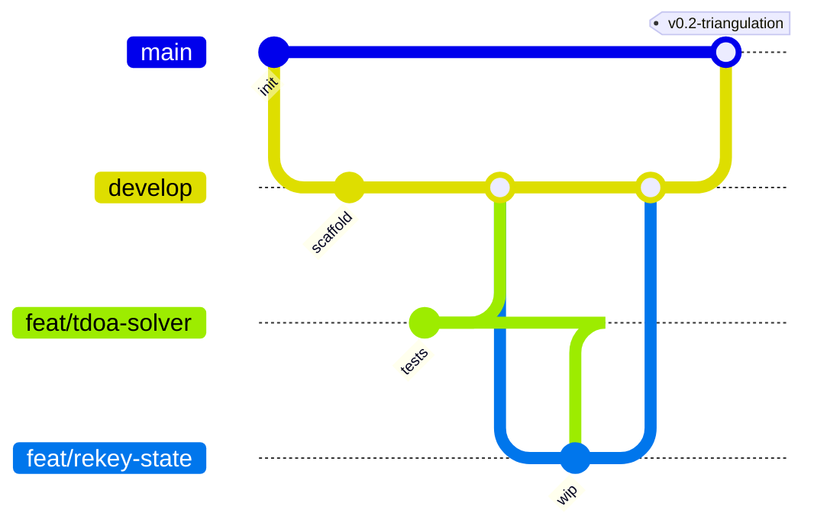
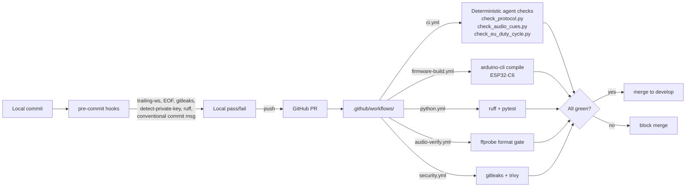

# Contributing

## Branch model



- **`main`** — protected; only fast-forwarded from `develop` at milestone tags.
- **`develop`** — integration; default working branch. Pushed feature branches merge here.
- **`feat/<short-name>`** — feature branches off `develop`. Merge back via PR (or local merge for solo work) once green.

## Commit-message format (Conventional Commits)

```
<type>(<scope>): <subject>
```

Type prefixes:

| Prefix | When to use |
|---|---|
| `feat:` | New behavior visible in firmware or analysis |
| `fix:` | Bug fix |
| `proto:` | Anything that changes wire format in `shared/Protocol.h` — bump version byte in same commit |
| `crypto:` | Changes to `shared/Crypto.h`, key derivation, rekey logic, or `SECURITY.md` |
| `chore:` | Build / tooling / dependency / `.gitignore` |
| `docs:` | Docs only |
| `refactor:` | No behavior change |
| `test:` | Adding or fixing tests / harnesses |

Scope is optional but encouraged: `feat(master): add Bancroft TDOA solver`.

## Code style

### Arduino sketches (.ino, .h, .cpp)

- 2-space indent, no tabs.
- Allman braces (open brace on its own line) for function defs; K&R for inline conditionals (matches existing Arduino library style).
- LF line endings (enforced by `.gitattributes`).
- Prefer `uint8_t` / `int16_t` over `byte` / `int` in protocol code.
- All packet structs `__attribute__((packed))`; verify with `static_assert(sizeof(...) == N)`.

### Python (analysis)

- PEP 8, 4-space indent, type hints on public functions.
- Format with `black`, lint with `ruff` (config in `DataAnalysisLog/pyproject.toml`).

### PowerShell scripts

- CRLF line endings (`.gitattributes`).
- `Set-StrictMode -Version Latest` and `$ErrorActionPreference = 'Stop'` at top of every script.

## Wire-format changes (the `proto:` prefix)

Any change to `shared/Protocol.h` must:

1. Increment the `version` byte in **every** packet struct that changed.
2. Update `static_assert(sizeof(...) == N)` to match new layout.
3. Update the byte-count column in [ARCHITECTURE.md](ARCHITECTURE.md) airtime table.
4. Update [shared/LoRaConfig.h](shared/LoRaConfig.h) airtime budget if packet size changed by >4 bytes.
5. Trigger the `lora-protocol-reviewer` agent (`.claude/agents/lora-protocol-reviewer.md`) before merging.

## Crypto changes (the `crypto:` prefix)

Any change to `shared/Crypto.h`, key derivation, rekey state machine, or `shared/keys/`:

1. Document the change in `SECURITY.md`.
2. Justify in the PR description **why** the change is needed (threat-model update, library bump, etc.).
3. Never reduce: tag length, key length, jitter range minimum, rekey-interval ceiling.
4. Get a second pair of eyes — crypto is the one place "trust me bro" is not acceptable.

## CI + pre-commit

Every PR runs three layers of automated checks. **Install pre-commit locally** so you catch the same failures the CI would:

```powershell
pip install pre-commit
pre-commit install            # registers the per-commit hook
pre-commit install --hook-type commit-msg  # registers the conventional-commit hook
pre-commit run --all-files    # one-time pass over the whole repo
```



### Agent-driven review (optional, judgmental)

The deterministic scripts above (`scripts/check_*.py`) are a subset of what the Claude Code agents in `.claude/agents/` know how to check. For richer review — judging whether a `proto:` change is sensible, not just whether it compiles — invoke the agent in Claude Code:

```
> review my Protocol.h changes with lora-protocol-reviewer
> validate the latest triangulation changes
> curate audio cues
```

CI never invokes the LLM agents — only the deterministic mirrors. The agents are for human-in-loop calls and don't gate merges.

## PR checklist

- [ ] Branch name matches `feat/`, `fix/`, `proto/`, `crypto/`, `chore/`, `docs/` convention.
- [ ] Commits follow Conventional Commits.
- [ ] If `proto:` — version bumped, sizes asserted, ARCHITECTURE.md updated.
- [ ] If `crypto:` — SECURITY.md updated, rationale in PR description.
- [ ] If touching `.claude/agents/*.md` — corresponding tool allowlist updated in `.claude/settings.json`.
- [ ] No secrets, `.priv` keys, or `.env` files added.
- [ ] Pre-commit hooks pass locally (`pre-commit run --all-files`).
- [ ] CI green on `ci`, `security`, and the per-subsystem workflows touched by the change.
