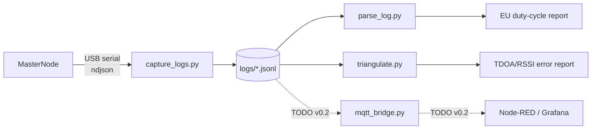

# DataAnalysisLog

Offline analysis, log schema, and triangulation harness for the master node's output stream.



See [log_format.md](log_format.md) for the on-wire JSON schema and [TODO_motorola_bridge.md](TODO_motorola_bridge.md) for the deferred analytics + radio-bridge scope.

## Scripts (v0.1 — stubs)

| Script | Purpose | Status |
|---|---|---|
| `parse_log.py` | Summarize a log: detections per band, alerts per soldier, duty-cycle audit | stub |
| `triangulate.py` | Re-run the master's TDOA/RSSI solver offline against captured logs | stub |
| `capture_logs.py` | Read master's USB serial, append to `logs/YYYY-MM-DD.jsonl` | TODO |

## Running

```powershell
# Capture live (TODO):
python capture_logs.py --port COM5 --baud 115200 --out logs/

# Audit a captured log:
python parse_log.py --logs logs/2026-05-23.jsonl --report-duty-cycle

# Validate triangulation against a fixture:
python triangulate.py --fixture fixtures/tdoa_3pod_clear.jsonl --truth fixtures/tdoa_3pod_clear.truth.json
```

## Agents that wrap these scripts

- `.claude/agents/triangulation-validator.md` — runs `triangulate.py` against canonical fixtures and asserts error thresholds.
- `.claude/agents/eu-duty-cycle-auditor.md` — runs `parse_log.py --report-duty-cycle` and flags any node exceeding the EU 36 s/hour budget.

## Related: demo-side audit

`../scripts/demo_audit.py` is a parallel verifier specifically for the browser demo's scenarios — it mirrors the JS multilateration solver in pure Python and asserts per-scenario expectations (km bucket set, distinct bearing cues, max localisation error). Runs over `../demo/data/scenarios/*.json`, exits 0/1. Separate from this folder's `triangulate.py` (which remains a centroid stub against canonical fixtures); see [../demo/README.md](../demo/README.md) for the demo verification surfaces.

## Fixtures committed

- `fixtures/fpv_incursion_demo.jsonl` + `.truth.json` — a single-window ndjson snapshot demonstrating the canonical v1 schema as emitted by the demo's master simulator. Used as a smoke-test fixture for `triangulate.py`.
