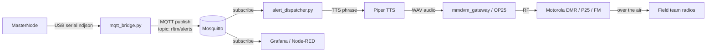

# TODO: Motorola radio bridge + analytics layer (deferred from v0.1)

This is the next subsystem after the LoRa mesh + soldier audio is stable. Documented here so it's not forgotten.

## Goal

## Open design questions

1. **Radio protocol target** — analog FM, DMR, or P25? Different open-source bridges (Direwolf for FM, MMDVM for DMR, OP25 for P25).
2. **Trigger policy** — every alert? Or only CRITICAL (high-confidence + close)? Likely the latter — radio bandwidth is precious.
3. **TTS pipeline** — Piper (offline, fast) vs. system TTS vs. pre-recorded phrase concatenation (could reuse the same WAV library the soldier nodes use).
4. **Dispatcher placement** — Raspberry Pi colocated with the master node, or a separate machine at HQ?
5. **MQTT auth** — TLS client cert, ACL per topic. Should the cert be issued from the same SSH-key flow as in `SECURITY.md`? Probably not — separate concern, use mTLS with a project CA.

## Scope when picked up

- Spec the MQTT topic tree: `rftm/{master_id}/{detect|alert|rekey|heartbeat}`.
- Build `mqtt_bridge.py` to ingest the master's serial JSON and publish to MQTT.
- Build `alert_dispatcher.py` that subscribes, applies a policy filter, and emits TTS-driven audio.
- Build the radio-gateway adapter (one of Direwolf / MMDVM / OP25 depending on Q1).
- Document the deploy: Mosquitto + Node-RED + Grafana docker-compose under `DataAnalysisLog/deploy/`.
- Threat-classification ML upgrade on the master (vs. current rule-based) — separate epic.

## Out of scope even for the bridge phase

- Encrypted MQTT payloads beyond mTLS (the LoRa AES-EAX stops at the master; what leaves the master to the broker is over a trusted local LAN or VPN).
- DMR/P25 encryption (depends on radio hardware support and licensing).
