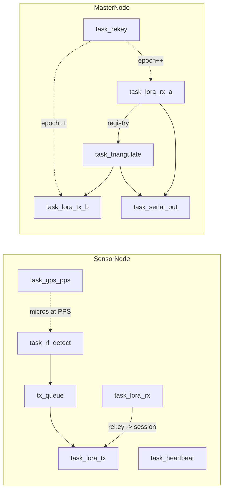

# LoRaMeshing

ESP32-C6 + SX1262 firmware for **sensor pods** and **master node**.

## Sketches

| Sketch | Role | Listens on | Transmits on |
|---|---|---|---|
| `SensorNode/SensorNode.ino` | Detects RF emitters in its band; reports to master | Freq B (rekey) | Freq A (DetectPacket) |
| `MasterNode/MasterNode.ino` | Triangulates, alerts soldiers, rotates keys | Freq A (DetectPacket) | Freq B (AlertPacket, RekeyPacket) |

## Task topology

## Pin map (placeholder — confirm against `ModuleDesign/Elect/`)

| Function | GPIO | Notes |
|---|---|---|
| LoRa NSS | 7 | SX1262 SPI CS |
| LoRa DIO1 | 5 | IRQ |
| LoRa RST | 4 | |
| LoRa BUSY | 6 | |
| GPS PPS | 3 | ISR-attached (RISING) for TDOA timestamps |
| GPS RX (MCU side) | 16 | NMEA from u-blox NEO-M9N |
| GPS TX (MCU side) | 17 | |
| RF detector ADC | 1 | Band-specific log detector (AD8318 etc.) |
| TX_ACTIVE | 2 | HIGH during LoRa TX — gates a co-located SDR / the redundant radio's RX (self-jam, gap B6) |
| I²C SDA / SCL | 21 / 22 | Battery monitor / IMU (master only) |

The SX1262 SPI bus uses the default `SPI` peripheral on ESP32-C6.

## Build steps

1. Install libraries (`arduino-cli lib install ...`):
   - `RadioLib`
   - `ArduinoJson`
   - `TinyGPSPlus`
   - `Crypto` (rweather/arduinolibs — provides AES-EAX, Ed25519, Curve25519, SHA-256)
2. Provision keys (one-time per node): see [`../shared/keys/README.md`](../shared/keys/README.md).
3. Sync shared headers: `pwsh ../shared/sync_shared.ps1`.
4. Open the sketch in Arduino IDE 2.x, board = "ESP32C6 Dev Module".
5. Compile + flash.

## TODOs (skeleton -> v0.2)

- [ ] Wire `aead_decrypt` properly with sender-id hint table in `MasterNode::task_lora_rx_a`.
- [ ] Implement TDOA solver (Bancroft closed-form) in `task_triangulate`.
- [ ] Implement RSSI multilateration fallback.
- [ ] Implement `task_rekey` body: ephemeral X25519, Ed25519 sign, 2-frame chunked TX.
- [ ] Add NVS encrypted-partition loader for per-node private keys.
- [ ] Battery monitor ADC scaling + `FLAG_LOW_BATTERY` setting.
- [ ] Per-band frontend calibration table (ADC -> dBm).
