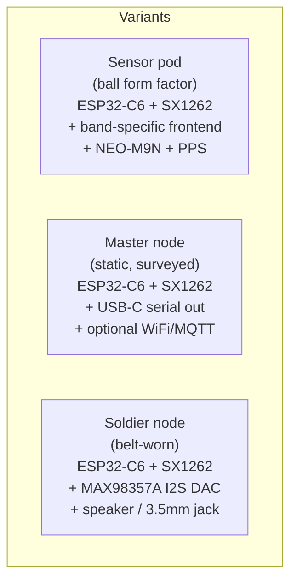

# ModuleDesign

Mechanical (`Body/`) and electrical (`Elect/`) design for the three node form factors.

## Layout

| Path | Tool | Contents |
|---|---|---|
| `Body/pod/` | Fusion 360 / FreeCAD | Ball enclosure for sensor pods (sphere with mounting boss) |
| `Body/master/` | | Static box for master node — IP54, antenna gland |
| `Body/soldier/` | | Belt-mount pouch with cable strain relief for speaker |
| `Elect/carrier/` | KiCad | Shared carrier board: ESP32-C6 + SX1262 + power tree |
| `Elect/frontends/` | KiCad | Per-band RF frontend daughterboards (5.8 GHz, 2.4 GHz, GNSS L1, 868 MHz EU) |
| `Elect/audio/` | KiCad | MAX98357A breakout for soldier node |

## TODOs (out of scope for v0.1)

- [ ] BOM + cost per pod variant
- [ ] PCB stackup for the carrier board (4-layer recommended for RF)
- [ ] Antenna selection per band (PCB trace vs external SMA)
- [ ] Thermal analysis on the ball enclosure for outdoor 40 °C ambient
- [ ] Drop test spec for soldier node
