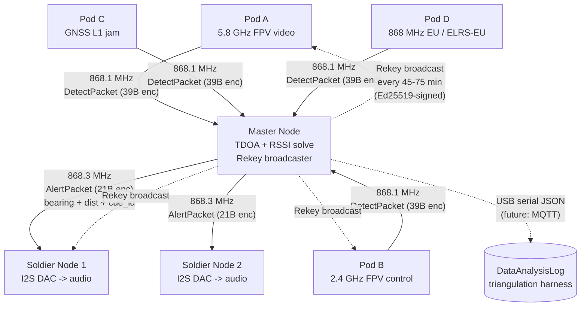
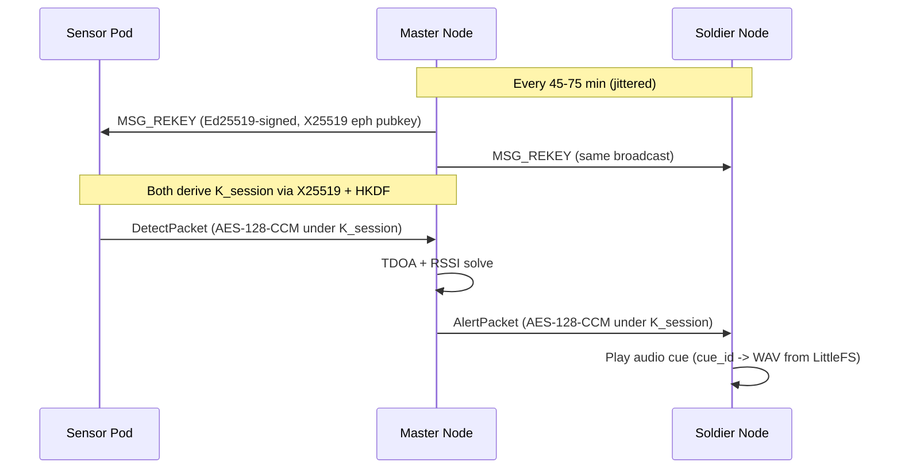

# TENEBRIS — RF-threat detection mesh

> **Silent Watch · Passive Defense.** Open-source counter-drone detection.

A distributed mesh of ESP32-C6 + SX1262 LoRa sensor pods listens for hostile RF emitters (FPV drone video, FPV control, GNSS L1 jam, tactical radio jamming), localises them by RSSI multilateration (TDOA-ready on PPS-synced pods), and warns dismounted soldiers with pre-recorded audio cues over an encrypted LoRa downlink. Passive — we never transmit on the threat's band.

Brand identity lives in [branding/](branding/) (full spec in [branding/Readme.md](branding/Readme.md), reusable web tokens in [branding/web/](branding/web/README.md)).

## Architecture at a glance





See [ARCHITECTURE.md](ARCHITECTURE.md) for full detail, [shared/Protocol.h](shared/Protocol.h) for the wire format, [SECURITY.md](SECURITY.md) for SSH + LoRa crypto policy.

## Security highlights

- **All LoRa packets encrypted + authenticated** with AES-128-CCM (8-byte tag).
- **Session keys rotate every 45–75 min** (60 min ± 15 min jitter), via Ed25519-signed X25519 rekey broadcast → HKDF-SHA256.
- **Per-node Ed25519 identity keys**, pinned at provisioning. No PKI, no PSK, no shared secrets in repo.
- **Forward secrecy** — ephemeral X25519 on every rekey; past traffic stays safe even if a long-term key leaks later.
- **GitHub auth: SSH-only** with passphrase-protected ed25519 key + `ssh-agent`. No PATs, no HTTPS remotes.

## Clone

```powershell
git clone git@github.com:selectdimensions/Hackathon.git
```

SSH must be set up first — see [SECURITY.md](SECURITY.md).

## Repo layout (monorepo)

| Path | Responsibility |
|---|---|
| `shared/` | Wire-format headers + crypto helpers — single source of truth |
| `shared/keys/pinned/` | Per-node Ed25519 + X25519 public keys (committed) |
| `LoRaMeshing/` | Sensor + master firmware (FreeRTOS dual-task RX/TX + rekey state machine) |
| `Rx/` | Soldier-node receiver firmware + audio playback |
| `ModuleDesign/` | Enclosure CAD + SX1262 carrier-board KiCad |
| `DataAnalysisLog/` | JSON log schema + triangulation harness + canonical fixtures |
| `UserNotification/` | Pre-recorded audio cue library + manifest (8 kHz WAV) |
| `AudioClips/` | TTS navigation library (MP3, en + fr) — fine-grained heading / distance cues |
| `branding/` | TENEBRIS brand identity package + `branding/web/` (CSS tokens, fonts, logo) — single source of truth for any web surface |
| `demo/` | Self-contained HTML demo + test harness (Leaflet, offline-first) |
| `scripts/` | Deterministic agent-check equivalents + `demo_audit.py` verifier |
| `.claude/agents/` | Project-scoped Claude Code subagents |

## Branch model

- `main` — tagged releases only
- `develop` — integration, default working branch
- `feat/<name>` — feature branches off `develop`

Conventional commit prefixes: `feat:`, `fix:`, `proto:` (wire-format change), `crypto:` (key-handling change), `chore:`, `docs:`. See [CONTRIBUTING.md](CONTRIBUTING.md).

## Build

1. Install Arduino IDE 2.x + `esp32` board package ≥ 3.0 (RISC-V support).
2. Install libraries: `RadioLib`, `ArduinoJson`, `TinyGPSPlus`, `rweather Crypto`.
3. Provision keys: `shared/keys/gen_node_key.ps1 <node_id>` (offline, on a trusted machine).
4. Generate pinned header: `shared/keys/gen_pinned_header.ps1`.
5. Sync shared headers: `shared/sync_shared.ps1`.
6. Open `LoRaMeshing/SensorNode/SensorNode.ino` (or `MasterNode`, or `Rx/SoldierNode`), select board "ESP32C6 Dev Module", flash.

## Status

v0.2 — protocol + brand layer + interactive demo + verification harness landed. Firmware bodies are still skeletons (see TODOs in `LoRaMeshing/MasterNode/MasterNode.ino` and `Rx/SoldierNode/SoldierNode.ino`). Out-of-scope (Motorola DMR/P25 bridge, MQTT/Grafana analytics, TTS pipeline) is documented in [DataAnalysisLog/TODO_motorola_bridge.md](DataAnalysisLog/TODO_motorola_bridge.md).

**Next milestone: `v0.3-hardware`.** The proposed move from AD8318 log-detector pods to Raspberry Pi 5 + RTL-SDR/HackRF pods (with the ESP32-C6 retained as a per-pod LoRa/crypto companion, plus a KrakenSDR at the master site for direction-finding) is specced in [docs/V02_PIVOT.md](docs/V02_PIVOT.md). Its gap analysis against the current scaffold — issues + concrete changes — is tracked in [V02_GAP_ANALYSIS.md](V02_GAP_ANALYSIS.md). (Note: the source report is titled "v0.2" by its author; in this repo v0.2 is already the demo/protocol milestone, so the SDR/hardware track is tracked as **`v0.3-hardware`**.)

The pod platform (fixed bus + swappable sensor) and the sensor catalog with localization roles live in [pod-sensor-reference.md](pod-sensor-reference.md); the milestone plan is [docs/ROADMAP.md](docs/ROADMAP.md); the system/pitch-level spec is [TACTICAL_SENSOR_NETWORK_SPEC.md](TACTICAL_SENSOR_NETWORK_SPEC.md).

## Live demo

[demo/](demo/) is a self-contained HTML visualisation of the full pipeline running on a Leaflet map — 25-pod LoRa mesh, command-and-control node, soldier audio cues — driven by simulated `DetectPacket` / `AlertPacket` events whose JSON matches [DataAnalysisLog/log_format.md](DataAnalysisLog/log_format.md) v1. Works fully offline (vendored Leaflet + procedural basemap, vendored fonts). Four scenarios with S / W / V / relocating-static drone paths. See [demo/README.md](demo/README.md).

Three verification surfaces:
- **Deterministic Python audit:** `python scripts/demo_audit.py` — runs every scenario through a JS-mirror multilateration solver, asserts per-scenario expectations, exits 0/1.
- **In-browser test harness:** `http://localhost:8000/demo/test.html` — same assertions exercising the actual JS code path. PASS / FAIL table + downloadable JSON report.
- **Live debug inspector:** `http://localhost:8000/demo/?debug=1` — floating panel with sim/real clock, emitter ground truth, solve estimate, error, queue depth. `[⬇ snapshot]` dumps state + last 200 events.

## Pitch

8-minute hackathon pitch script (5-min brief + 3-min live demo) for a Belgian defence / critical-infrastructure audience: [PITCH.md](PITCH.md).
