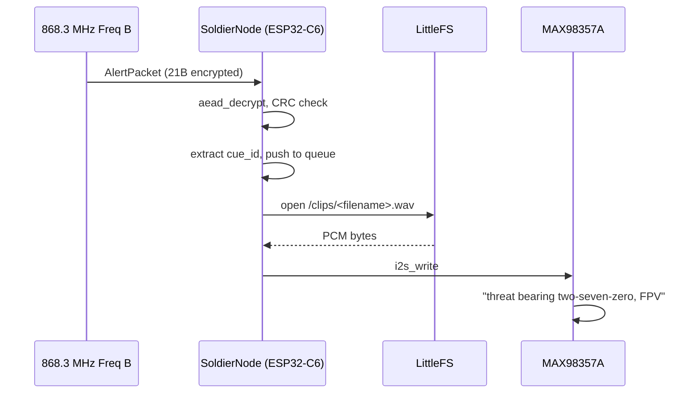

# Rx

Soldier-node receiver firmware. ESP32-C6 + SX1262 LoRa + MAX98357A I2S DAC.

## Behavior



## Wiring (MAX98357A → ESP32-C6)

| MAX98357A | ESP32-C6 GPIO | Notes |
|---|---|---|
| LRC (LRCLK) | 13 | I²S word-select |
| BCLK | 12 | I²S bit clock |
| DIN | 14 | I²S data in |
| GAIN | float / GND / Vcc | 9/12/15 dB respectively |
| SD | high or float | Shutdown — high = on |
| Vin | 3.3 V or 5 V | 5 V recommended for full 3.2 W |
| GND | GND | |

Speaker: 4–8 Ω, 1–3 W. For headphones, add a 10 Ω series resistor + DC-blocking cap on the speaker output, or use a dedicated headphone amp.

## Audio clip upload (LittleFS)

```powershell
arduino-cli compile --fqbn esp32:esp32:esp32c6 .
# To upload clips/, use the ESP32 LittleFS filesystem uploader plugin
# (Arduino IDE 2.x: Tools -> ESP32 Sketch Data Upload) pointing at
# the local ../UserNotification/clips/ directory.
```

For headless flow: use `mklittlefs` to bake a `data/` partition image and `esptool.py` to flash it.

## Self-test build flag

Set `#define RFTM_SELFTEST 1` in `SoldierNode.ino` to make the node sequentially play every cue ID at boot. Useful for verifying clip uploads and DAC wiring without needing a live mesh.

## TODOs

- [ ] Wire `aead_decrypt` properly (sender = `NODE_ID_MASTER`).
- [ ] Implement `task_rekey` reception branch (verify Ed25519 sig, derive session key).
- [ ] Optional: IMU + magnetometer task to convert absolute bearing → relative ("threat at your three o'clock").
- [ ] Battery monitor + haptic alert as silent fallback to audio.
- [ ] WAV header parsing instead of fixed-44-byte skip (handles non-canonical clips).
