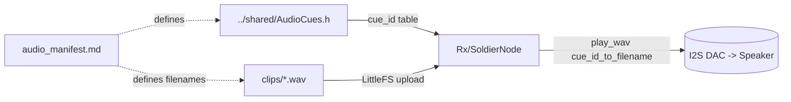

# UserNotification

Pre-recorded audio cue library played on the soldier node when an `AlertPacket` arrives.

## Files

| Path | Purpose |
|---|---|
| [audio_manifest.md](audio_manifest.md) | Human-readable cue_id ↔ filename ↔ phrase table |
| `clips/*.wav` | The actual audio (8 kHz mono 16-bit PCM, ≤2 s each) |
| [generate_clips.md](generate_clips.md) | TTS recipe to regenerate clips from manifest |

## Format requirements (enforced by the `audio-cue-curator` agent)

- **Sample rate:** 8000 Hz
- **Channels:** mono
- **Bit depth:** 16-bit PCM (`pcm_s16le`)
- **Length:** ≤ 2 seconds per clip
- **Naming:** matches `filename` column in [audio_manifest.md](audio_manifest.md) exactly
- **Total library size:** ≤ 2 MB (fits comfortably in 4 MB LittleFS partition)

`ffprobe` is used to verify; see the agent's spec for the exact invocation.

## Upload to soldier node

After generating `clips/*.wav`, upload via the Arduino IDE 2.x ESP32 LittleFS plugin (Tools → ESP32 Sketch Data Upload), pointing it at `data/clips/` symlinked from this directory.

For headless: bake an image with `mklittlefs`, flash with `esptool.py`.
