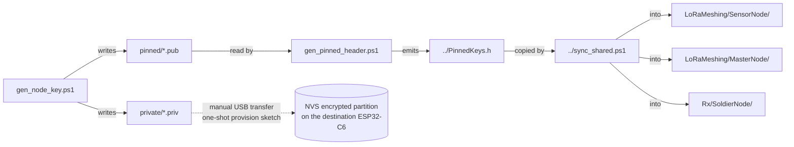

# shared/keys/

Per-node Ed25519 + X25519 keypairs and the generated `PinnedKeys.h` baked into firmware.



## Layout

| Path | Committed? | Purpose |
|---|---|---|
| `pinned/*.pub` | YES | 32-byte raw Ed25519 / X25519 public keys |
| `private/*.priv` | NO (gitignored) | 32-byte raw private keys — destroy or move to offline backup after flashing |
| `../PinnedKeys.h` | NO (gitignored, regenerated) | Auto-generated C header for firmware |

## Workflow

1. **Generate** keypairs for every node in the mesh (master + each pod + each soldier):
   ```powershell
   .\gen_node_key.ps1 -NodeId 0x80 -Name master
   .\gen_node_key.ps1 -NodeId 0x01 -Name pod_a
   .\gen_node_key.ps1 -NodeId 0x02 -Name pod_b
   .\gen_node_key.ps1 -NodeId 0xA0 -Name soldier_1
   ```
2. **Bake** the public keys into the firmware header:
   ```powershell
   .\gen_pinned_header.ps1
   ```
3. **Sync** the header into each sketch directory:
   ```powershell
   ..\sync_shared.ps1
   ```
4. **Flash** the *one-shot provision sketch* to each node (TODO: `Provision/Provision.ino`). The provision sketch reads the matching `node_<name>_<id>_*.priv` files from USB MSC, writes them into the ESP32-C6 encrypted NVS partition, then erases the staging area.
5. **Flash** the actual application sketch (SensorNode / MasterNode / SoldierNode). It reads private keys from NVS at boot and never sees them in source.

## Revocation

If a key is suspected compromised:

1. Move the compromised `.pub` files **out** of `pinned/` (do not delete — keep them in a `revoked/` subdir for audit).
2. Re-run `gen_pinned_header.ps1` and `sync_shared.ps1`.
3. Reflash all surviving nodes. The compromised node's signatures will now be rejected, and its identity will not key-agree with any peer.

## Threat-model reminder

- The `.priv` files in `private/` are sensitive. Treat them like SSH host keys: trusted-workstation-only, never in CI artifacts, never in a shared Drive, never in chat.
- The `pinned/*.pub` files are NOT sensitive. Committing them is the point — they're how every node knows which signatures to trust.
